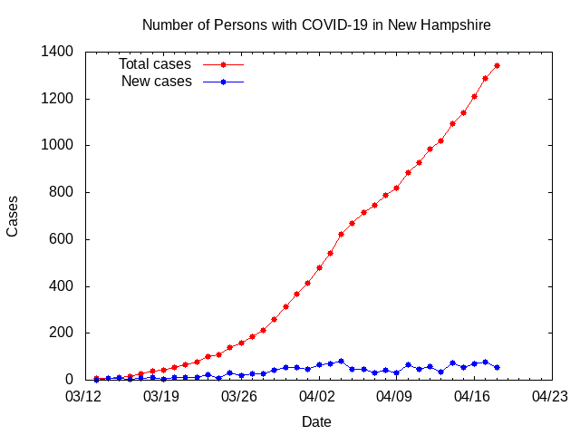

Tracking COVID-19 with Gnuplot
==============================

I've been wanting to visualize how cases of COVID-19 in New Hampshire
are progressing. The State of New Hampshire puts out a daily updates
with this information, but it's in narrative form and scattered across
PDF files uploaded daily.

So, I decided to use [Gnuplot](http://www.gnuplot.info/) to help me 
visualize what is happening. I created the text file below with the data
from the daily updates, which I gather manually. Each line contains
the date in MM/DD/YYYY form, the current number of reported cases and
the number of new cases reported. These values are tab-separated.

    # covid.dat - COVID-19 statistics in New Hampshire
    # Source: https://www.nh.gov/covid19/news/updates.htm
    
    # Date		Cases	Change
    3/13/2020	7	0
    3/14/2020	7	7
    3/15/2020	13	6
    3/16/2020	17	4
    3/17/2020	26	9
    # ...
    4/10/2020	885 66

I haven't used Gnuplot much since college, so I had to consult a number of
online tutorials to dust off my memory. After a lot of finagling I was
able to coax Gnuplot into graphing this data in an attractrive manner.

    # covid.plot - gnuplot commands to generate COVID-19 graphs from online data
    
    # Set up output graphic parameters.
    set term png
    set output "covid.png"
    
    # Set up the graph title, axes labels and graph key.
    set title "Number of Persons with COVID-19 in New Hampshire"
    set xlabel "Date"
    set ylabel "Cases"
    set key top left
    
    # Set up the x-axis to show dates.
    set xdata time
    set format x "%m/%d"
    
    # Tell Gnuplot that we are reading dates in a specific format.
    set timefmt "%m/%d/%Y"
    
    # Set up line stylings.
    set style line 1 linecolor rgb "red" pointtype 7
    set style line 2 linecolor rgb "blue" pointtype 7
    
    # Read data from file and plot into a graph.
    plot "covid.dat" using 1:2 with linespoints linestyle 1 title "Total cases", \
     	 "covid.dat" using 1:3 with linespoints linestyle 2 title "New cases"

This will give me a red line showing the total number of reported
cases and a blue line showing the new cases each day. Every evening the
State issues its daily report and I manually enter the new data into
covid.dat. Finally, I issue the command:

   gnuplot covid.plot 

And I get the file covid.png which looks like this:

